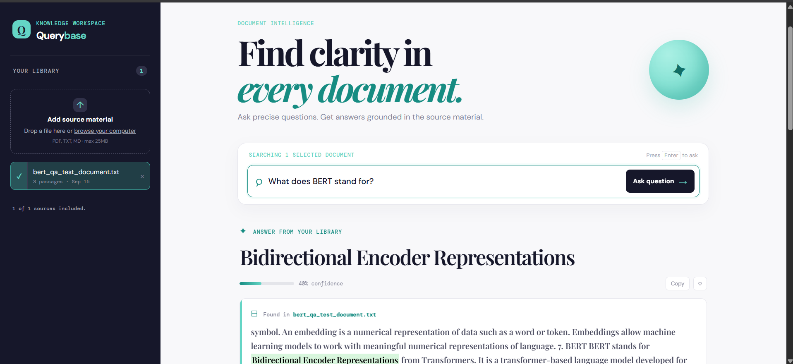

# 🤖 AI Document Question Answering System using BERT

An AI-powered Document Question Answering web application built using **FastAPI, PyTorch, and Hugging Face Transformers**. The application uses a fine-tuned **BERT Question Answering model** to extract accurate answers from uploaded documents.

---

## 📸 Application Screenshot



---

## 🚀 Features

* 🤖 Fine-tuned BERT Transformer for extractive Question Answering
* 📄 Upload `.txt`, `.md`, and `.pdf` documents
* 🔍 Intelligent document retrieval
* 💬 Ask questions about uploaded documents
* 🎯 Extract answers directly from document context
* 📊 Confidence score for generated answers
* ⚡ High-performance FastAPI backend
* 🌐 Responsive React web interface
* ☁️ Hugging Face model hosting
* 🚀 Backend deployment using Render
* 🌍 Frontend deployment using Vercel
* 📡 REST API support

---

## 🛠️ Tech Stack

| Category            | Technology                |
| ------------------- | ------------------------- |
| Language            | Python                    |
| Backend             | FastAPI                   |
| Deep Learning       | PyTorch                   |
| NLP                 | Hugging Face Transformers |
| Model               | Fine-tuned BERT           |
| Frontend            | React + Vite              |
| Styling             | CSS / Tailwind CSS        |
| Document Processing | PyPDF                     |
| Server              | Uvicorn                   |
| Model Hosting       | Hugging Face Hub          |
| Backend Deployment  | Render                    |
| Frontend Deployment | Vercel                    |

---

## 🧠 How It Works

```text
                 ┌─────────────────────┐
                 │      User           │
                 │ Upload Document     │
                 │ Ask Question        │
                 └──────────┬──────────┘
                            │
                            ▼
                 ┌─────────────────────┐
                 │   React Frontend    │
                 │      Vite           │
                 └──────────┬──────────┘
                            │
                            ▼
                 ┌─────────────────────┐
                 │    FastAPI Backend  │
                 └──────────┬──────────┘
                            │
                 ┌──────────┴──────────┐
                 ▼                     ▼
        ┌─────────────────┐   ┌─────────────────┐
        │ Document        │   │   Retriever     │
        │ Processing      │   │ Relevant Chunks │
        └─────────────────┘   └────────┬────────┘
                                       │
                                       ▼
                              ┌─────────────────┐
                              │ Fine-tuned BERT │
                              │  QA Model       │
                              └────────┬────────┘
                                       │
                                       ▼
                              ┌─────────────────┐
                              │ Extracted Answer│
                              │ + Confidence    │
                              └─────────────────┘
```

---

## 📁 Project Structure

```text
qa-system/
│
├── backend/
│   ├── main.py
│   ├── qa_engine.py
│   ├── retriever.py
│   ├── storage.py
│   ├── pdf_reader.py
│   ├── requirements.txt
│   ├── .python-version
│   ├── bert_qa_model/
│   │   ├── config.json
│   │   ├── tokenizer.json
│   │   └── tokenizer_config.json
│   └── .gitignore
│
├── frontend/
│   ├── src/
│   ├── public/
│   ├── package.json
│   ├── vite.config.js
│   └── index.html
│
└── README.md
```

> The trained `model.safetensors` file is hosted separately on Hugging Face and is not stored directly in GitHub.

---

## 🤗 Fine-Tuned BERT Model

The fine-tuned BERT Question Answering model is hosted on Hugging Face:

[Kothakotla/bert-qa-system](https://huggingface.co/Kothakotla/bert-qa-system?utm_source=chatgpt.com)

The model contains:

```text
config.json
model.safetensors
tokenizer.json
tokenizer_config.json
```

The deployed backend loads the model from Hugging Face using the `HF_MODEL_ID` environment variable.

---

## ⚙️ Installation

### 1. Clone the Repository

```bash
git clone https://github.com/prasadkothakotla/QA-Bert-.git
cd QA-Bert-
```

---

### 2. Create a Virtual Environment

#### Windows

```bash
python -m venv venv
venv\Scripts\activate
```

#### Linux / macOS

```bash
python3 -m venv venv
source venv/bin/activate
```

---

### 3. Install Backend Dependencies

```bash
cd backend
pip install -r requirements.txt
```

---

### 4. Configure Hugging Face Model

For deployment, set:

```text
HF_MODEL_ID=Kothakotla/bert-qa-system
```

For local development, the application can use the local model directory:

```text
backend/bert_qa_model/
```

---

## ▶️ Run the Application

### Start the Backend

From the `backend` directory:

```bash
python -m uvicorn main:app --reload --port 8000
```

The API will be available at:

```text
http://127.0.0.1:8000
```

Swagger API documentation:

```text
http://127.0.0.1:8000/docs
```

---

### Start the Frontend

Open another terminal:

```bash
cd frontend
npm install
npm run dev
```

The frontend will normally be available at:

```text
http://localhost:5173
```

---

## 📡 API Endpoints

### Upload Document

```http
POST /documents/upload
```

Supports:

```text
.txt
.md
.pdf
```

---

### Get Documents

```http
GET /documents
```

Returns the list of uploaded documents.

---

### Ask a Question

```http
POST /ask
```

### Request

```json
{
  "question": "What is BERT?",
  "doc_ids": null,
  "top_k_chunks": 5
}
```

### Response

```json
{
  "answer": "Bidirectional Encoder Representations from Transformers",
  "score": 0.95,
  "doc_id": "document-id",
  "doc_title": "bert.txt",
  "context": "BERT stands for Bidirectional Encoder Representations from Transformers...",
  "answer_start": 0,
  "answer_end": 60
}
```

---

### Delete Document

```http
DELETE /documents/{doc_id}
```

Deletes a document using its document ID.

---

### Health Check

```http
GET /health
```

Example response:

```json
{
  "status": "ok",
  "documents": 1
}
```

---

## 💻 Example

### Input Document

```text
BERT stands for Bidirectional Encoder Representations from Transformers.
It is a transformer-based language model developed by Google.
BERT can be used for various natural language processing tasks.
```

### Question

```text
What does BERT stand for?
```

### Output

```text
Bidirectional Encoder Representations from Transformers
```

---

## 🔄 Application Workflow

```text
1. User uploads a document
            ↓
2. FastAPI receives the document
            ↓
3. Text is extracted from the document
            ↓
4. Document is divided into relevant chunks
            ↓
5. Retriever searches for relevant passages
            ↓
6. BERT QA model receives:
      Question + Context
            ↓
7. BERT extracts the answer span
            ↓
8. API returns:
      Answer + Confidence + Context
            ↓
9. React displays the answer
```

---

## ☁️ Deployment

### Frontend

The React frontend is deployed using:

[Vercel](https://qa-bert-rfkt.vercel.app/)

### Backend

The FastAPI backend is deployed using:

[Render](https://qa-bert-5.onrender.com)

### Model

The fine-tuned BERT model is hosted using:

[Hugging Face](https://huggingface.co/?utm_source=chatgpt.com)

---

## 🔐 Environment Variables

### Frontend

```env
VITE_API_URL=https://qa-bert-5.onrender.com
```

### Backend

```env
HF_MODEL_ID=Kothakotla/bert-qa-system
```

---

## ✨ Future Improvements

* 📚 Support multiple documents simultaneously
* 💾 Persistent document storage
* 🔐 User authentication
* 👤 User-specific document collections
* 🧠 Improve answer ranking
* 📊 Add answer confidence visualization
* 🔎 Advanced semantic search
* 📄 DOCX document support
* 🌍 Multi-language Question Answering
* 💬 Conversation history
* 🗂️ Document management dashboard
* ⚡ Model optimization for faster inference
* 📱 Improved mobile UI
* ☁️ Scalable cloud deployment

---

## 🤝 Contributing

Contributions are welcome!

1. Fork the repository
2. Create a feature branch
3. Make your changes
4. Commit your changes
5. Push the branch
6. Open a Pull Request

---

## 📄 License

This project is licensed under the **MIT License**.

---

## 👨‍💻 Author

**Prasad Kothakotla**

GitHub:
https://github.com/prasadkothakotla

---

## ⭐ Support

If you found this project useful, please consider giving the repository a ⭐ Star on GitHub.

It helps support the project and motivates further development.
